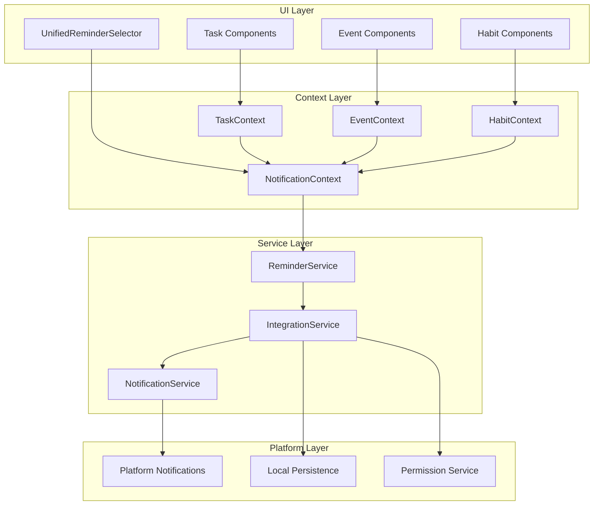
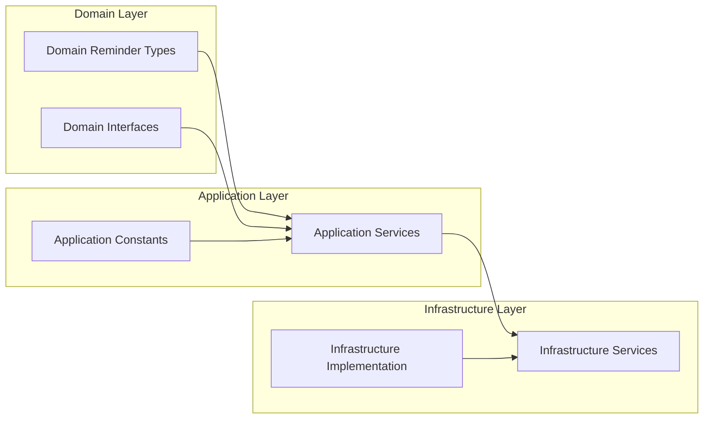

# New Reminder System Architecture

## System Overview



## Key Design Principles

### 1. Separation of Concerns
- **UI Layer**: Presentational components
- **Context Layer**: State management and business logic
- **Service Layer**: Platform integration and persistence
- **Platform Layer**: Native notifications API

### 2. Standardized Reminder Times
- 1 minute before
- 5 minutes before  
- 30 minutes before
- Custom time

### 3. Clean Architecture


## Core Components

### 1. ReminderDomain (Types & Interfaces)
- `ReminderType`: Standardized reminder types
- `ReminderConfig`: Configuration interface
- `ReminderResult`: Scheduling result type

### 2. ReminderService (Business Logic)
- Calculate reminder times
- Validate reminder configurations
- Handle reminder scheduling logic

### 3. NotificationService (Platform Integration)  
- Expo notifications integration
- Permission handling
- Platform-specific configurations

### 4. IntegrationService (Orchestration)
- Coordinate between services
- Handle cross-cutting concerns
- Error handling and logging

## Benefits of New Design

1. **Single Responsibility**: Each service has one clear purpose
2. **Testability**: Easy to unit test individual components
3. **Maintainability**: Clear separation of concerns
4. **Extensibility**: Easy to add new reminder types
5. **Performance**: Reduced complexity and overhead
6. **Clean Code**: Follows SOLID principles

## Implementation Flow

```mermaid
sequenceDiagram
    participant UI as UI Component
    participant Context as NotificationContext
    participant Reminder as ReminderService
    participant Integration as IntegrationService
    participant Platform as NotificationService
    
    UI->>Context: Set reminder config
    Context->>Reminder: Calculate reminder time
    Reminder->>Reminder: Validate configuration
    Reminder->>Integration: Schedule reminder
    Integration->>Platform: Create notification
    Platform-->>Integration: Return notification ID
    Integration-->>Reminder: Return result
    Reminder-->>Context: Return success/failure
    Context-->>UI: Update UI state